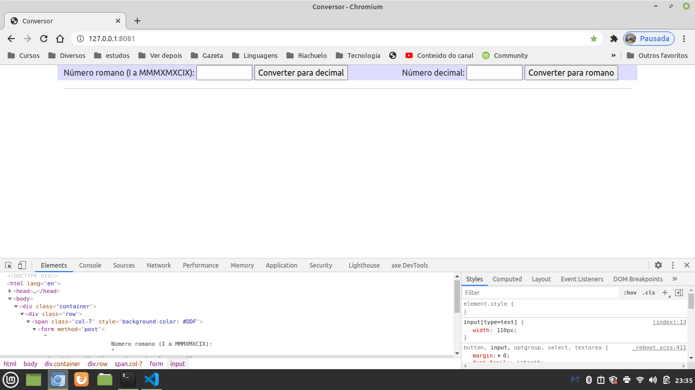
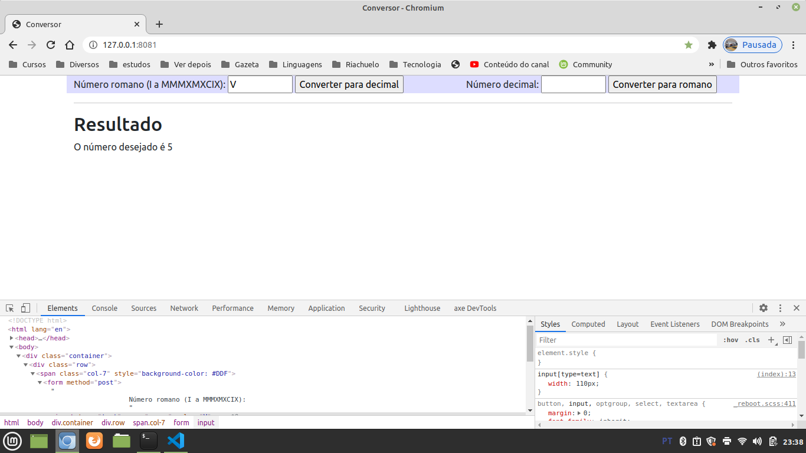
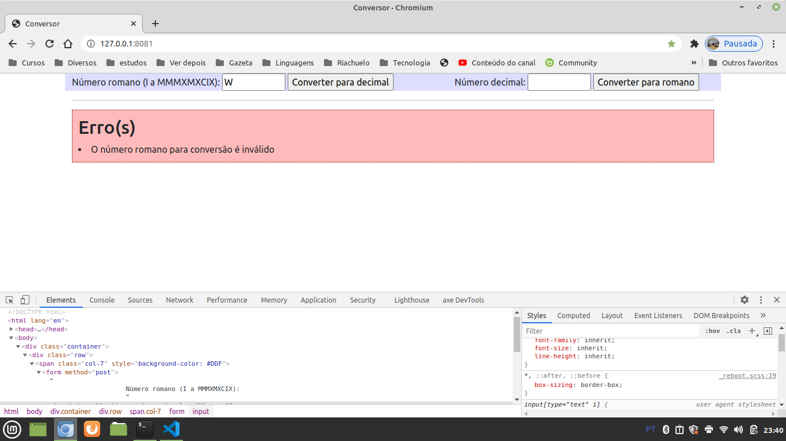

# General

**OBS:** In progress


# Install

You need don't anything special to install. You will need only of PHP 7+.


# Run

In terminal, root directory:

```
php -S 0.0.0.0:8081
```

And in a browser please open the address `http://127.0.0.1:8081`


# Execution

In the browser you will see this page:


Then you can use a textbox and click at the button in this right position. Ilustrating:


Case you insert a wrong string to convert you will see an error:


